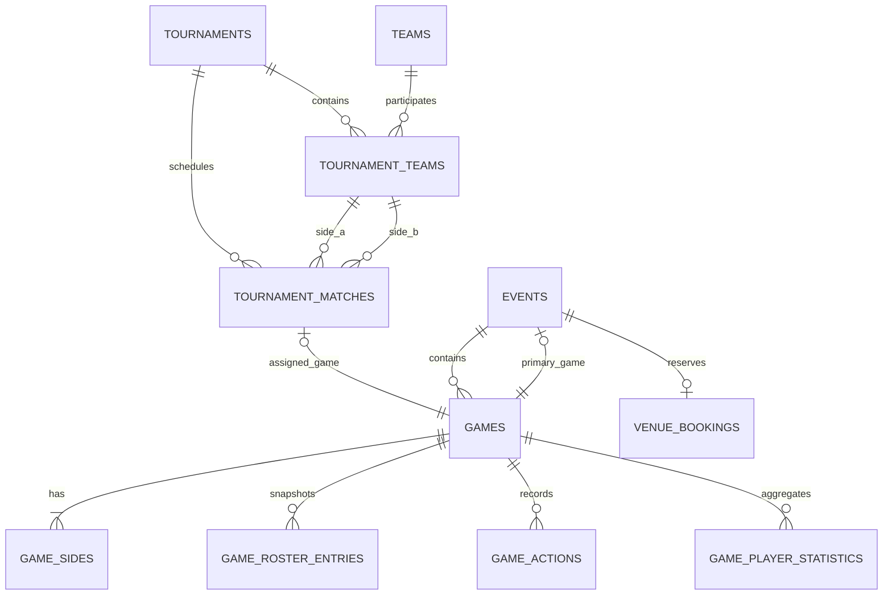

# Целевая схема Event, Game и Tournament

## Статус

Утверждённый проект схемы задачи 086. Миграции ещё не реализованы.

## Оглавление

- [Соглашения](#соглашения)
- [Изменения events](#изменения-events)
- [Изменения games](#изменения-games)
- [tournaments](#tournaments)
- [tournament_teams](#tournament_teams)
- [tournament_matches](#tournament_matches)
- [Контракты и media](#контракты-и-media)
- [Ограничения уровня приложения](#ограничения-уровня-приложения)
- [Индексы чтения](#индексы-чтения)
- [Стратегия данных](#стратегия-данных)

## Соглашения

- все публичные агрегаты используют bigint ID и soft deletes;
- alias индексируется, но не уникален;
- публичный route identifier имеет вид `{id}-{alias}`;
- timestamps, связанные с расписанием и lifecycle, хранятся как timezone-aware;
- FK на actor использует `restrictOnDelete`, кроме явно исторических nullable actor refs;
- enum повторяют локальный enum-паттерн и имеют `label(): string`;
- бизнес-инварианты повторно проверяются внутри транзакционного application service.



## Изменения events

Сохраняются текущие поля организационного агрегата. Целевые изменения:

```text
primary_game_id bigint nullable unique
short_description text nullable
full_description text nullable
```

После переноса текущий `description` удаляется. `primary_game_id` добавляется после таблицы games и
ссылается на `games.id` с `nullOnDelete`. Application invariant требует
`events.primary_game_id.event_id = events.id`.

Для Event type game `primary_game_id` обязателен после завершения транзакции создания. Для training,
game_training и open_training он null. Связь `Event::games()` остаётся hasMany для embedded games.

`starts_at` и `ends_at` остаются обязательными. Venue и VenueBooking остаются связанными с Event.

## Изменения games

Удаляются как дубли Event после переноса:

```text
title
description
scheduled_starts_at
scheduled_ends_at
```

Добавляются:

```text
status_comment text nullable
format enum nullable
timing_mode enum whole_game|periods not null
periods_count enum-like unsigned smallint nullable (2|4)
```

Сохраняются:

```text
id
event_id
created_by_actor_id
status
side_a_size
side_b_size
scoring_type
statistics_mode
statistics_status
statistics_version
actual/completed/cancelled timestamps и actor refs
winner_game_side_id
timestamps
deleted_at
```

`format`:

```text
basketball_5x5
streetball_3x3
streetball_1x1
custom
null
```

Preset является снимком настроек Game. Для standalone-формы он задаёт начальные размеры сторон,
scoring и periods; несовпадающая ручная конфигурация сохраняется как `custom`. Для streetball
`periods_count` всегда null, для basketball по умолчанию используется 4. Nullable format нужен для
унаследования до создания Game и совместимости исторических записей; изменение Tournament не
перезаписывает уже созданную Game.

`scoring_type` остаётся `basketball|streetball`. При `whole_game` periods_count равен null, при
`periods` допускаются только 2 или 4. Изменение side sizes, не соответствующее preset, устанавливает
`format=custom` application-сервисом.

## game_periods

```text
id bigserial primary key
game_id bigint not null FK games cascade
number unsigned smallint not null
status enum scheduled|in_progress|completed
actual_started_at / actual_ended_at nullable
started_by_actor_id / ended_by_actor_id nullable FK actors restrict
ended_early boolean not null default false
status_comment text nullable
side_a_score unsigned smallint nullable
side_b_score unsigned smallint nullable
created_at / updated_at
unique(game_id, number)
```

Для периодной игры штатное завершение доступно в последнем активном периоде. Досрочное
завершение доступно в более раннем активном периоде, требует комментарий, закрывает текущий
период и переводит Game в ожидание подтверждения результата; оставшиеся периоды не запускаются.

`game_actions.game_period_id` nullable FK. Для whole_game он null; для periods application invariant
требует ссылку на единственный активный период этой же Game.

## tournaments

```text
id bigserial primary key
created_by_actor_id bigint not null FK actors restrict
title varchar(150) not null
alias varchar(180) not null
status enum not null default confirmed
status_comment text null
starts_on date not null
ends_on date null
short_description text null
full_description text null
format enum null
created_at / updated_at
deleted_at null
```

Checks:

```text
ends_on IS NULL OR ends_on >= starts_on
```

Indexes:

```text
index(alias)
index(status, starts_on)
index(starts_on, ends_on)
index(created_by_actor_id, created_at)
```

Tournament format использует те же preset values, кроме `custom`: общий Tournament задаёт
рекомендуемый формат, а нестандартные размеры принадлежат конкретной Game.

## tournament_teams

```text
id bigserial primary key
tournament_id bigint not null FK tournaments cascade
team_id bigint not null FK teams restrict
status enum not null default active
seed unsigned smallint null
position unsigned integer not null
joined_at timestamptz null
withdrawn_at timestamptz null
created_at / updated_at
```

Статусы:

```text
active
withdrawn
disqualified
```

Constraints:

```text
unique(tournament_id, team_id)
unique(tournament_id, position)
```

Строки не получают soft delete на первом этапе: после появления Match связь является частью
истории и меняет status. Ошибочно добавленную команду до создания матчей можно удалить физически
через application service.

## tournament_matches

```text
id bigserial primary key
tournament_id bigint not null FK tournaments cascade
side_a_tournament_team_id bigint not null FK tournament_teams restrict
side_b_tournament_team_id bigint not null FK tournament_teams restrict
game_id bigint null unique FK games restrict
round unsigned integer null
sequence unsigned integer not null
created_at / updated_at
deleted_at null
```

Constraints:

```text
unique(tournament_id, sequence)
check(side_a_tournament_team_id <> side_b_tournament_team_id)
```

Application checks подтверждают, что обе TournamentTeam принадлежат `tournament_id`. Ссылка на
TournamentTeam вместо прямого team_id сохраняет статус участия и seed конкретного Tournament.

Match status не хранится: presentation state выводится из `game_id` и `Game.status`.

## Контракты и media

Новые таблицы ACL не создаются. Используются:

```text
contract_memberships.scope_type = tournament
contract_memberships.scope_id = tournaments.id
contract_permissions.permission = tournament permission value
```

Tournament и Event используют morphMany Media. Game media применяется только для спортивных
артефактов, которые не являются публичной обложкой Event; правило назначения media фиксируется в
application API.

## Ограничения уровня приложения

Следующие правила нельзя надёжно выразить переносимыми FK/check constraints и они проверяются после
locks:

- primary Game принадлежит тому же Event;
- Event type game имеет primary Game, другие типы — нет;
- обе TournamentTeam матча принадлежат Tournament;
- GameSide teams соответствуют TournamentTeam матча;
- Event турнирной игры находится внутри Tournament interval;
- Team не участвует в пересекающихся матчах Tournament;
- стартеры и капитаны соответствуют roster и side sizes;
- Tournament нельзя отменить при Game in_progress;
- подтверждённый результат учитывается в standings один раз.

## Индексы чтения

Дополнительно к unique constraints:

```text
tournament_matches(tournament_id, round, sequence)
tournament_matches(game_id)
tournament_teams(team_id, status)
games(event_id, status)
events(primary_game_id)
```

Индексы уточняются через `EXPLAIN` после появления фактических запросов; speculative indexes не
добавляются без read model.

## Стратегия данных

Для локальной разработки и тестовых данных утверждён `fresh-seed`: целевая схема строится без
искусственного transitional compatibility layer. Аудит VDS не блокирует локальное проектирование,
реализацию и acceptance.

Перед будущим применением на VDS обязателен отдельный deployment gate:

1. инвентаризация таблиц и количества строк;
2. проверка, являются ли данные пользовательскими или только demo;
3. резервная копия базы и media;
4. отдельное подтверждение допустимости fresh reset;
5. если reset недопустим — проектируется expand/migrate/contract migration до deployment.

Наличие локального решения `fresh-seed` не является разрешением уничтожать данные VDS.
