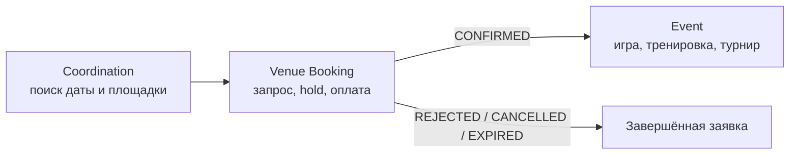
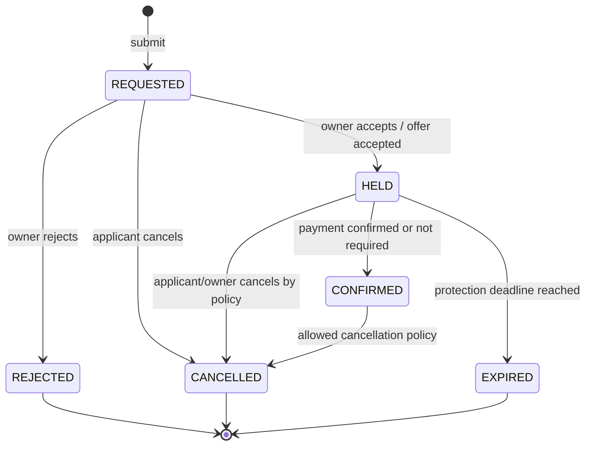
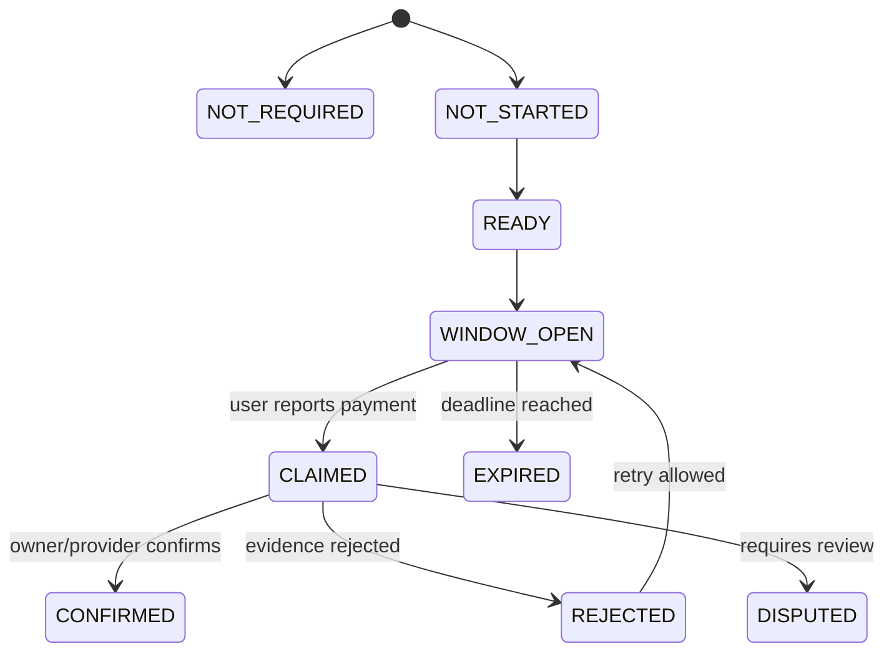
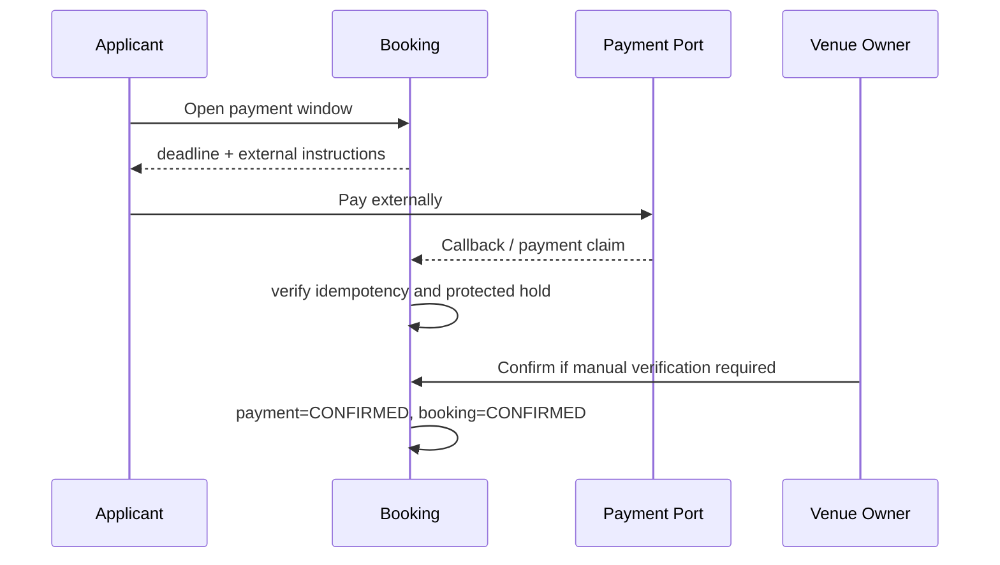
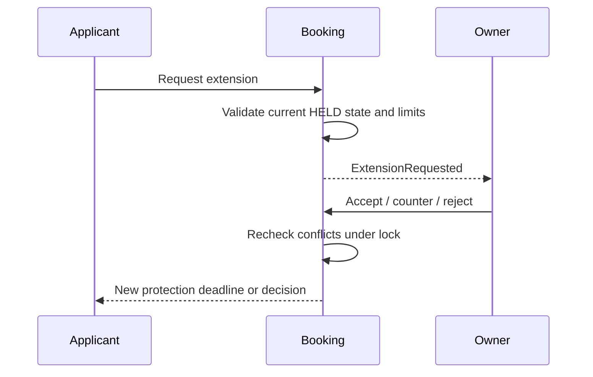
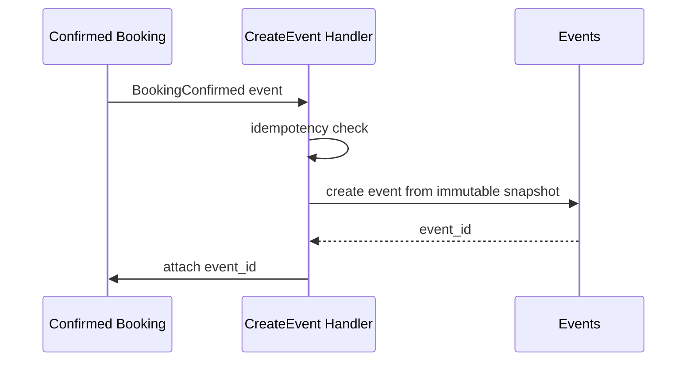
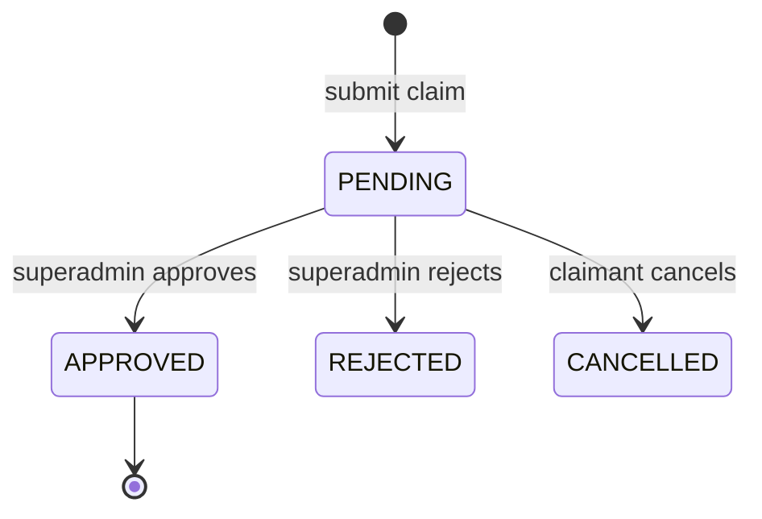

# Целевая архитектура flow аренды площадки

## 1. Границы задачи

Flow аренды строится как отдельный доменный процесс между предварительной координацией и созданием мероприятия:

Ключевое разделение ответственности:

- `Coordination` помогает договориться о намерении, дате, интервале и площадке;
- `VenueBooking` фиксирует коммерческое предложение, резервирует ресурс и проводит заявку до подтверждения;
- `Event` появляется только после подтверждённой брони либо создаётся независимо существующим способом;
- платёжная интеграция подтверждает оплату, но не управляет жизненным циклом брони напрямую;
- чат и уведомления объясняют переходы, но не являются источником истины.

## 2. Доменные контексты

### Venue Catalog

Владеет карточкой площадки и её физическими возможностями: типом, числом игровых зон, доступностью половин, адресом и состоянием публикации. Не хранит условия конкретной заявки.

### Venue Commercial Management

Владеет подтверждённым коммерческим владельцем площадки, участниками договора, полномочиями и версиями коммерческой политики. Создатель карточки площадки не становится коммерческим владельцем автоматически.

### Venue Booking

Главный transactional-контекст. Владеет заявкой, её статусом, интервалом, областью бронирования, снимком условий, hold-дедлайнами, переговорами о продлении, состоянием оплаты и историей переходов.

### Coordination

Владеет опросами и решениями группы до подачи заявки. Передаёт в booking выбранные значения, но не резервирует площадку.

### Events

Получает подтверждённую бронь и создаёт мероприятие идемпотентно. После создания мероприятия booking остаётся самостоятельной записью и ссылкой на основание мероприятия.

### Payments

Предоставляет порт подтверждения внешней оплаты. На первом этапе MSKBA не становится платёжным кошельком и не ведёт пользовательские балансы.

## 3. Основные агрегаты и таблицы

### `venue_ownership_claims`

Заявка на коммерческое владение площадкой:

- `venue_id`, `claimant_user_id`;
- статус `PENDING | APPROVED | REJECTED | CANCELLED`;
- доказательства и комментарий модератора;
- `reviewed_by`, `reviewed_at`;
- timestamps и audit metadata.

Одобрение создаёт или обновляет `ContractMembership` с ролью `OWNER`. До одобрения заявитель не получает коммерческих полномочий.

### `venue_booking_policies`

Версионируемые условия владельца:

- `venue_id`, `version`, `is_active`;
- разрешены ли заявки, аренда целиком и по половинам;
- минимальная/максимальная длительность и шаг времени;
- валюта, базовая цена, правила расчёта;
- длительность первичного hold, лимиты и стоимость продления;
- платёжное окно и правила подтверждения;
- правила отмены в пределах MVP.

Старая версия не перезаписывается, если по ней существуют заявки. Активируется новая версия.

### `venue_bookings`

Корень агрегата:

- заявитель, площадка, необязательный `event_id`;
- интервал `[starts_at, ends_at)`;
- scope `WHOLE | ZONE_A | ZONE_B`;
- статус `REQUESTED | HELD | CONFIRMED | REJECTED | CANCELLED | EXPIRED`;
- текущие `hold_expires_at`, `effective_protection_until`;
- `policy_id`, `policy_version` и неизменяемый quote snapshot;
- payment state и внешняя ссылка/идентификатор без секретных данных;
- optional source coordination и idempotency key;
- optimistic version, timestamps.

`REQUESTED` не занимает ресурс. `HELD` и `CONFIRMED` занимают ресурс. Терминальные статусы ресурс не занимают.

### `venue_booking_quote_revisions`

Неизменяемая история коммерческих предложений. Содержит нормализованные параметры и JSON snapshot для объяснимости старых заявок. Новое предложение создаёт новую ревизию, а не редактирует старую.

### `venue_booking_transitions`

Append-only timeline доменных переходов: предыдущее/новое состояние, actor, reason, command id, metadata и время. Это бизнес-история, а системный `Auditable` остаётся техническим аудитом.

### `venue_booking_extension_requests`

Переговоры о продлении hold: запрошенная длительность, цена/условия, статус, дедлайн ответа и actor каждой стороны.

### `venue_booking_conversations`

Диалог по заявке хранится отдельно от timeline. Сообщение не меняет статус автоматически; команда перехода явно ссылается на сообщение или причину.

### `venue_booking_contributions`

Приватные обещания участников покрыть часть стоимости. Эти данные видят участник, организатор заявки и уполномоченные владельцем пользователи. Это не публичный `PollBallot`.

### `venue_booking_payment_attempts`

Попытки подтверждения оплаты с provider reference, idempotency key, статусом, суммой и временем. Секреты провайдера в БД не сохраняются.

## 4. Машина состояний брони

Переходы выполняются только command handlers. Модель и UI не должны менять status напрямую.

Инварианты:

- нельзя подтвердить заявку без действующего hold;
- нельзя выдать hold при конфликтующей защищённой брони;
- нельзя продлить или оплатить терминальную заявку;
- Event создаётся один раз только из `CONFIRMED`;
- новый входящий callback не может вернуть агрегат из терминального состояния;
- все временные сравнения выполняются в одной серверной timezone и сохраняются в UTC.

## 5. Состояние оплаты

Состояние оплаты отделено от статуса брони:

Для платной аренды booking остаётся `HELD`, пока payment state не станет `CONFIRMED`. Защита интервала действует до `effective_protection_until`, который учитывает основное время hold и открытое платёжное окно. Продлевать это время можно только явной доменной командой.

## 6. Переговоры о продлении

Продление не должно молча менять quote snapshot. Если меняются деньги или условия, создаётся новая quote revision, явно принятая второй стороной.

## 7. Область бронирования и конфликты

В коммерческом flow половины доступны, только если одновременно выполняются условия:

- площадка физически имеет минимум две игровые зоны;
- активная коммерческая политика разрешает раздельную аренду;

Для обычного создания мероприятия коммерческая политика не применяется: выбор `whole|half_a|half_b`
определяется только физическими зонами площадки и их занятостью. Тип мероприятия и формат игры не
меняют доступный физический ресурс.

Правила пересечения для полуинтервалов `[start, end)`:

- `WHOLE` конфликтует с любой областью;
- `ZONE_A` конфликтует с `WHOLE` и `ZONE_A`;
- `ZONE_B` конфликтует с `WHOLE` и `ZONE_B`;
- `ZONE_A` и `ZONE_B` могут сосуществовать.

Необходимо использовать единый `VenueBookingConflictService` для создания, принятия, продления, переноса и подтверждения оплаты. UI-проверка является только подсказкой.

## 8. Транзакции, блокировки и deadlock-и

Основной mutex — строка площадки. Для всех команд, способных создать или продлить занятость, порядок блокировок одинаков:

1. площадка `FOR UPDATE`;
2. конфликтующие активные брони в порядке `id`;
3. целевая бронь;
4. дочерние quote/payment/extension записи в порядке `id`.

Это закрывает гонку MySQL, когда две транзакции не видят ещё не созданные строки друг друга. Одной проверки `exists()` недостаточно.

Вероятные deadlock-сценарии:

- параллельный перенос двух броней между площадками;
- callback оплаты одновременно с expiry job;
- продление hold одновременно с созданием новой заявки;
- создание Event одновременно с ручным подтверждением.

Предотвращение:

- сортировать несколько venue id перед захватом блокировок;
- короткие транзакции без HTTP и отправки уведомлений внутри;
- conditional updates с ожидаемой версией/статусом;
- ограниченный retry только для распознанных deadlock/serialization ошибок;
- события публиковать после commit, для критичных интеграций использовать outbox.

## 9. Command/query модель

Изолированные application handlers:

- `SubmitVenueBooking`;
- `AcceptVenueBooking` / `RejectVenueBooking`;
- `CancelVenueBooking`;
- `RequestHoldExtension` / `DecideHoldExtension`;
- `OpenPaymentWindow` / `ClaimExternalPayment` / `ConfirmPayment`;
- `ExpireVenueBooking`;
- `CreateEventFromConfirmedBooking`;
- `SubmitOwnershipClaim` / `ReviewOwnershipClaim`.

Handlers работают через порты репозиториев, policy/clock/payment/notification интерфейсы. Контроллеры отвечают за транспорт, request validation и authorization, но не содержат переходы состояний.

Query projections подготавливают списки «мои заявки», кабинет владельца, календарь занятости и timeline. Проекции не являются источником истины для команд.

## 10. Idempotency

Обязательные ключи:

- повторная отправка формы/Telegram callback;
- callback платёжного провайдера;
- expiry job;
- создание Event;
- подтверждение/отклонение владельцем;
- миграционные и repair-команды.

Одинаковый ключ с тем же payload возвращает прежний результат. Тот же ключ с другим payload отклоняется как конфликт.

## 11. Права доступа

Сервер проверяет:

- заявитель управляет собственной заявкой;
- владелец площадки либо `ContractMembership` с нужным permission управляет коммерческим решением;
- superadmin может действовать, когда подтверждённого владельца нет, и модерирует ownership claims;
- участник координации видит только доступную ему coordination-сессию;
- вклад видят только его автор, организатор заявки и уполномоченные менеджеры;
- payment evidence и контакты не попадают в публичные API и логи.

## 12. Coordination и Telegram

V1 coordination выбирает площадку, дату и интервал, после чего создаёт черновые параметры заявки. Голосование само по себе ничего не блокирует.

V2 attendance запускается только после `HELD`. Его дедлайн не может быть позже `effective_protection_until`; истечение брони завершает/замораживает сбор участников и уведомляет организатора.

Telegram и Mini App вызывают те же HTTP/application handlers, что web UI. Callback-и проверяются криптографически и идемпотентно. Транспорт не реализует отдельную бизнес-логику.

## 13. Создание Event

Параметры площадки, зоны и интервала копируются из подтверждённой брони. Последующее редактирование Event не должно разрушать историю коммерческого решения; изменение площадки/времени после подтверждения требует отдельного согласованного сценария, не скрытого update.

## 14. Владение площадкой

Одобрение claim и выдача `ContractMembership OWNER` выполняются в одной транзакции. Повторное одобрение идемпотентно. Смена владельца требует отдельного процесса, чтобы не потерять доступ к активным броням и истории.

## 15. UI и API

Минимальные интерфейсы:

- публичная карточка условий аренды и доступных scope;
- форма заявки с серверным quote preview;
- список и карточка заявок пользователя;
- кабинет владельца с очередью решений и календарём;
- timeline, сообщения, продление и оплата;
- модерация ownership claims;
- создание Event из подтверждённой брони;
- coordination с явным пояснением «голосование не резервирует площадку».

API возвращает машинные error codes (`BOOKING_CONFLICT`, `HOLD_EXPIRED`, `POLICY_CHANGED`, `PAYMENT_WINDOW_CLOSED`) и безопасный локализуемый текст. Кнопки отключаются для удобства, но защита всегда дублируется сервером.

## 16. Уведомления и realtime

Доменные события:

- `VenueBookingRequested`, `Held`, `Rejected`, `Cancelled`, `Expired`, `Confirmed`;
- `HoldExtensionRequested`, `Accepted`, `Rejected`;
- `PaymentWindowOpened`, `PaymentClaimed`, `PaymentConfirmed`, `PaymentDisputed`;
- `VenueOwnershipClaimSubmitted`, `Approved`, `Rejected`;
- `EventCreatedFromVenueBooking`.

Listeners после commit создают notification records, Reverb broadcasts и Telegram jobs. Доставка at-least-once, поэтому consumers идемпотентны. Ошибка Telegram не откатывает бронь.

## 17. Совместимость и миграция

Текущие `VenueBooking PENDING/CONFIRMED/CANCELLED` нельзя одномоментно переопределять без адаптера:

- на переходном этапе старые записи читаются через mapping;
- новые команды работают только с новой state machine под feature flag;
- существующий обязательный `event_id` становится nullable только после проверки всех consumers;
- backfill scope, policy snapshot и payment state выполняется батчами;
- старые маршруты продолжают работать, пока UI и Telegram не переключены;
- rollback флага не удаляет новые данные.

## 18. Этапы внедрения

1. Regression baseline, feature flags и observability.
2. Ownership claims и коммерческие permissions.
3. Политики, quote snapshot и новая booking schema.
4. Conflict engine, handlers, idempotency и timeline.
5. Coordination/Telegram integration.
6. Expiry, extension и external payment flow.
7. Conversations, contributions и realtime.
8. Confirmed booking → Event.
9. UI/projections, staged rollout и repair tools.

Каждый этап должен быть deployable независимо и не включаться для пользователей до готовности своих миграций, workers и rollback-пути.
