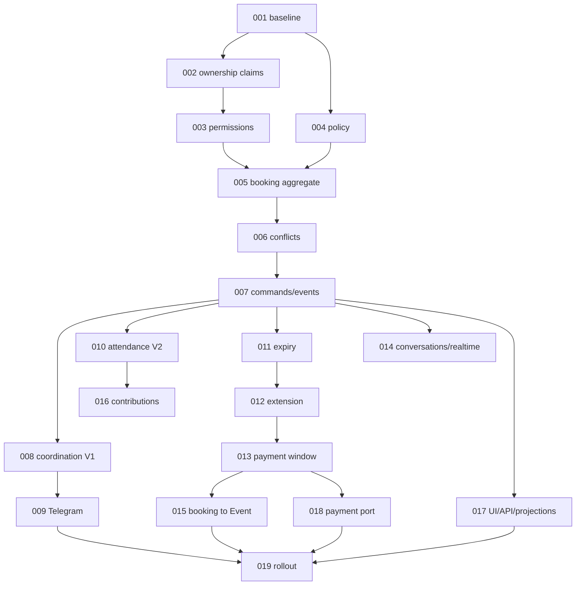

# Подзадачи 132

## Статус

Все подзадачи 001–019 выполнены в `feature/115`. Включение production flags и удаление legacy-кода не входят в автоматическое завершение задачи.

Подзадачи разбиты по архитектурным слоям и включаются последовательно. Нумерация задаёт рекомендуемый порядок, но часть UI и интеграционных работ может идти параллельно после стабилизации доменного ядра.

## Волны внедрения

1. **Безопасный фундамент:** 001–004.
2. **Транзакционное ядро бронирования:** 005–007.
3. **Координация и эксплуатация hold:** 008–013.
4. **Коммуникации и завершение flow:** 014–018.
5. **Поставка:** 019.

## Зависимости

## Перечень

- [001 — Regression baseline и feature flags](001-baseline-and-feature-flags.md)
- [002 — Заявки на владение площадкой](002-venue-ownership-claims.md)
- [003 — Коммерческие роли и права](003-commercial-permissions.md)
- [004 — Политики аренды и расчёт предложения](004-booking-policy-and-quote.md)
- [005 — Агрегат и жизненный цикл бронирования](005-booking-aggregate.md)
- [006 — Конфликты, блокировки и конкурентный доступ](006-conflicts-and-concurrency.md)
- [007 — Команды, идемпотентность, timeline и события](007-commands-idempotency-events.md)
- [008 — Coordination V1](008-coordination-v1.md)
- [009 — Telegram и Mini App](009-telegram-miniapp.md)
- [010 — Attendance coordination V2](010-attendance-v2.md)
- [011 — Истечение hold и scheduler](011-expiry-scheduler.md)
- [012 — Переговоры о продлении](012-hold-extension.md)
- [013 — Внешняя оплата и платёжное окно](013-external-payment-window.md)
- [014 — Переписка, realtime и уведомления](014-conversations-realtime.md)
- [015 — Создание Event из подтверждённой брони](015-confirmed-booking-to-event.md)
- [016 — Приватные вклады участников](016-private-contributions.md)
- [017 — UI, API и read projections](017-ui-api-projections.md)
- [018 — Платёжный порт и будущий ledger](018-payment-abstraction.md)
- [019 — Rollout, наблюдаемость и E2E](019-rollout-observability-e2e.md)
